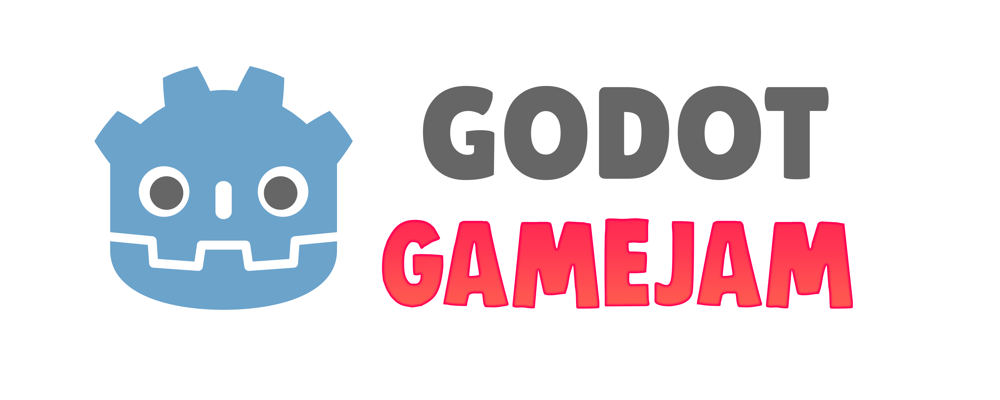
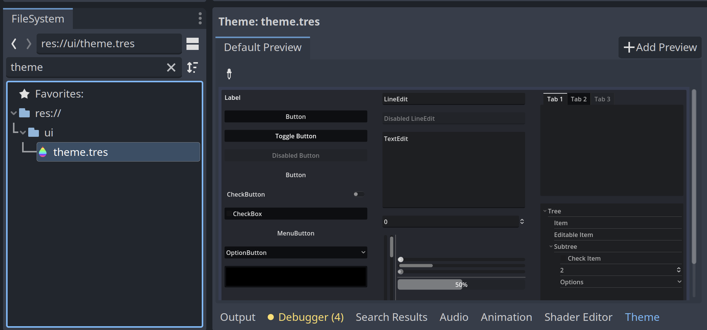

**🤖 Godot Engine 4.0 template to better get started for gamejams with your game!**

 

# 🧪 Features

### 🌌 **Game Settings**

This template project comes with game settings out of the box:

- **Audio volume** (Master, Sound, Music)
- **Game Language** (English only by default)

### ✨ **Bootsplash scene support**

Either use the default Godot bootsplash or define your own logo bootsplashes!

### 🎩 Basic menu flow (main menu, settings, pause)

This project comes with basic menu navigation that allows you to navigate between ingame, settings and quitting the game.

### 💾 Save Game Integration

Automatically saves the state of the game on exit. Starting a new game overrides the existing save game. Any game object that needs to be saved has to be part of the "Persist" group.

### 🌎 Translation support (i18n)

Comes with pre-defined translations that can be extended.

### ⏸ Pause Menu

The `IngameScene` supports a pause menu to temporarily pause the game.

### _🚀 Automatic [itch.io](https://itch.io) deployment_

This templates comes with automatic deployment to itch.io for MacOS, Windows, Linux and HTML5 (Web). Delete `.github/workflows/godot-ci.yml` in case you are not interested in deploying to itch.io!

1. generate new API key in your itch.io settings and setup your `BUTLER_API_KEY` secret - [learn more](https://docs.github.com/en/actions/security-guides/using-secrets-in-github-actions)
2. create a new game on itch.io
3. setup `ITCHIO_GAME` and `ITCHIO_USERNAME` secrets in Github and assign them to your itch.io username and game name

[See working example here](https://github.com/bitbrain/ggj-2023/blob/main/.github/workflows/godot-ci.yml)

# 🎮 Getting started!

1. Click `Use this template` in Github ([learn more about Template Repositories](https://docs.github.com/en/repositories/creating-and-managing-repositories/creating-a-repository-from-a-template))
2. Open the project in Godot Engine 4
3. Customize it to your needs (see [🧱 Customization](#-customization))
4. Open the `IngameScene` and start building your game!

# 🔌 Compatible Gamejams

> **Not all gamejams allow project templates!** Please make sure to carefully read the gamejam rules before using this project, otherwise you might **risk being disqualified**!

Down below is a list of some compatible gamejam formats that permit using this repository as a template:

- [GoGodotJam](https://gogodotjam.com/the-jam/)
- [Ludum Dare](https://ldjam.com/events/ludum-dare/rules)
- [GMTK Game Jam](https://itch.io/jam/gmtk-jam-2022)
- [Brackeys Gamejam](https://itch.io/jam/brackeys-7)
- [Global Game Jam](https://globalgamejam.org/news/be-cool-rules)
- [GameDevLondon Summer Jam](https://itch.io/jam/game-dev-london-summer-jam-2021)
- [Godot Wild Jam](https://itch.io/jam/godot-wild-jam-49)

# 🧱 Customization

This project is built to be as generic as possible and it can be fully adjusted to your needs.

## Defining custom UI theme

Search for the file `theme.tres` and open it. The [Godot theme editor](https://docs.godotengine.org/en/stable/tutorials/ui/gui_using_theme_editor.html) should appear. Feel free to customise the UI to your needs. Any `Control` node will use this theme by default:

## Choosing 2D vs 3D

This toolkit is not limited to either 2D or 3D. It has been kept vague on purpose so feel free to build 2D or 3D scenes with it!

## Custom boot splash

Within Godot Engine, head to `scenes/boot` to access boot splash scenes. You can create your custom bootsplash by either modifying `GodotBootsplashScene` or creating a new node of type `Control`. Add `BootsplashScene` as a child and configure its properties as follows:

- `Fade Duration` - the amount of time in milliseconds to fade in/out the bootsplash.
- `Stay Duration` - the amount of time in milliseconds the bootsplash should stay.
- `Node` - the node/scene that should be displayed during the bootsplash.
- `Next Scene` - the next scene that should be loaded after the bootsplash has finished.
- `Interruptable ` - wether the bootsplash is interruptable or not.

## Add new translation

You will find a translation file in `i18n/translation.csv`. Feel free to extend it to your needs. Godot will automatically pickup the translations if you use them inside your control nodes like `Button` or `Label`. In case you need to manually translate something in a script, call the `tr()` function.

In case you want to add a new language, add a new column to the `translation.csv` file.

## Game Settings

The game settings are managed in `UserSettings.gd`. You can change the defaults by updating `USER_SETTING_DEFAULTS`. You can also add additional properties to extend them.

The `GameSettings` node and the `GameSettings.gd` script connects to the `UserSettings` by setting it/loading from it.

## Save game configuration

By default, save games are enabled. You can toggle support for save games inside `SaveGame.gd` by changing the `ENABLED` property.

The save game saves any node inside the `IngameScene` that is part of the `Persist` group ([learn more about groups in Godot](https://docs.godotengine.org/en/stable/tutorials/scripting/groups.html)). The save game system will save existing nodes but also nodes that were dynamically added to the scene at runtime!

Currently, the game will only save the scene when exiting the game via the pause menu.

# 🍻 Contributing

Feel free to raise a pull request or suggest any changes or improvements you would like to see!

> 🐱‍💻 **PLEASE NOTE:** this project is a template and any contribution should only introduce/extend features that are template related. If something can be its own addon (e.g. movement controller or specific 2D/3D stuff) it probably should be its own (separate) addon.
